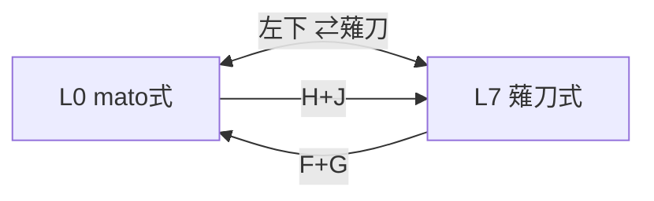

# LiNEA40-mato式 キーマップ + 薙刀式 L7

## レイヤー0 — mato式（通常）

```
┌─────┬─────┬─────┬─────┬─────┐     ┌─────┬─────┬─────┬─────┬─────┐
│  L  │  W  │  K  │  R  │  P  │     │ Esc │  U  │  O  │  Y  │  -  │
├─────┼─────┼─────┼─────┼─────┤     ├─────┼─────┼─────┼─────┼─────┤
│  H  │  S  │  T  │  N  │  M  │     │Bspc │  A  │  E  │  I  │  ,  │
├─────┼─────┼─────┼─────┼─────┤     ├─────┼─────┼─────┼─────┼─────┤
│ Win │ Alt │Ctrl │Shift│Space│     │     │Shift│Ctrl │ Alt │ Win │
└─────┴─────┴─────┴─────┴─────┘     └─────┴─────┴─────┴─────┴─────┘
┌─────┬─────┬─────┬─────┬─────┬─────┐ ┌─────┬─────┐ ┌─────┬─────┬─────┬─────┐
│⇄薙刀│     │     │ Ins │▲Num │▲Sht │ │▲Fn  │     │ ●L2 │ ●BT │Vol- │Vol+ │
│     │     │     │     │ Tab │Space│ │Enter│     │     │     │     │     │
└─────┴─────┴─────┴─────┴─────┴─────┘ └─────┴─────┘ └─────┴─────┴─────┴─────┘
```

**mato式からの変更:** 左下のみ `⇄薙刀`（旧: 空/trans）

---

## レイヤー7 — 薙刀式

上3段は **QWERTY 物理位置**（L0 の印字とは別）

```
┌─────┬─────┬─────┬─────┬─────┐     ┌─────┬─────┬─────┬─────┬─────┐
│  Q  │  W  │  E  │  R  │  T  │     │  Y  │  U  │  I  │  O  │  P  │
├─────┼─────┼─────┼─────┼─────┤     ├─────┼─────┼─────┼─────┼─────┤
│  A  │  S  │  D  │  F  │  G  │     │  H  │  J  │  K  │  L  │  ;  │
├─────┼─────┼─────┼─────┼─────┤     ├─────┼─────┼─────┼─────┼─────┤
│  Z  │  X  │  C  │  V  │  B  │     │  N  │  M  │  ,  │  .  │  /  │
└─────┴─────┴─────┴─────┴─────┘     └─────┴─────┴─────┴─────┴─────┘
┌─────┬─────┬─────┬─────┬─────┬─────┐ ┌─────┬─────┐ ┌─────┬─────┬─────┐
│⇄L0  │ Cmd │     │     │Space│▲Sht │ │▲Num │Space│▲Fn  │  ←  │  →  │
│     │     │     │     │     │ Tab │ │Bspc │     │     │     │     │
└─────┴─────┴─────┴─────┴─────┴─────┘ └─────┴─────┘ └─────┴─────┴─────┘
```

| 親指 | L7 |
|------|-----|
| 左下（30） | L0へ戻る |
| 31 | Command |
| 34 | ngSpace |
| 35 | Tab / L7用 ShortCut（L9） |
| 36 | Backspace / L7用 Number（L8） |
| 37 | ngSpace |
| 38 | L7用 Function（L10） |
| 39・40 | ← / →（`&kp`） |

**V + M 同時押し** → Enter（`zmk-naginata-v17` 内蔵）

---

## レイヤー一覧（mato式）

| # | 名前 | 主なアクセス |
|---|------|-------------|
| 0 | default | 通常・⇄薙刀 |
| 1 | MOUSE | （要設定） |
| 2 | Layer2 | `●L2` |
| 3 | Number | `▲Num Tab` |
| 4 | ShortCut | `▲Sht Space` |
| 5 | Function | `▲Fn Enter` |
| 6 | WIRELESS | `●BT` |
| 7 | NAGINATA | `⇄薙刀` / H+J |
| 8 | Number_NG | L7用 Number 複製 |
| 9 | ShortCut_NG | L7用 ShortCut 複製 |
| 10 | Function_NG | L7用 Function 複製 |

---

## L0 ⇔ L7



---

設定: [`config/LiNEA40.keymap`](config/LiNEA40.keymap)
